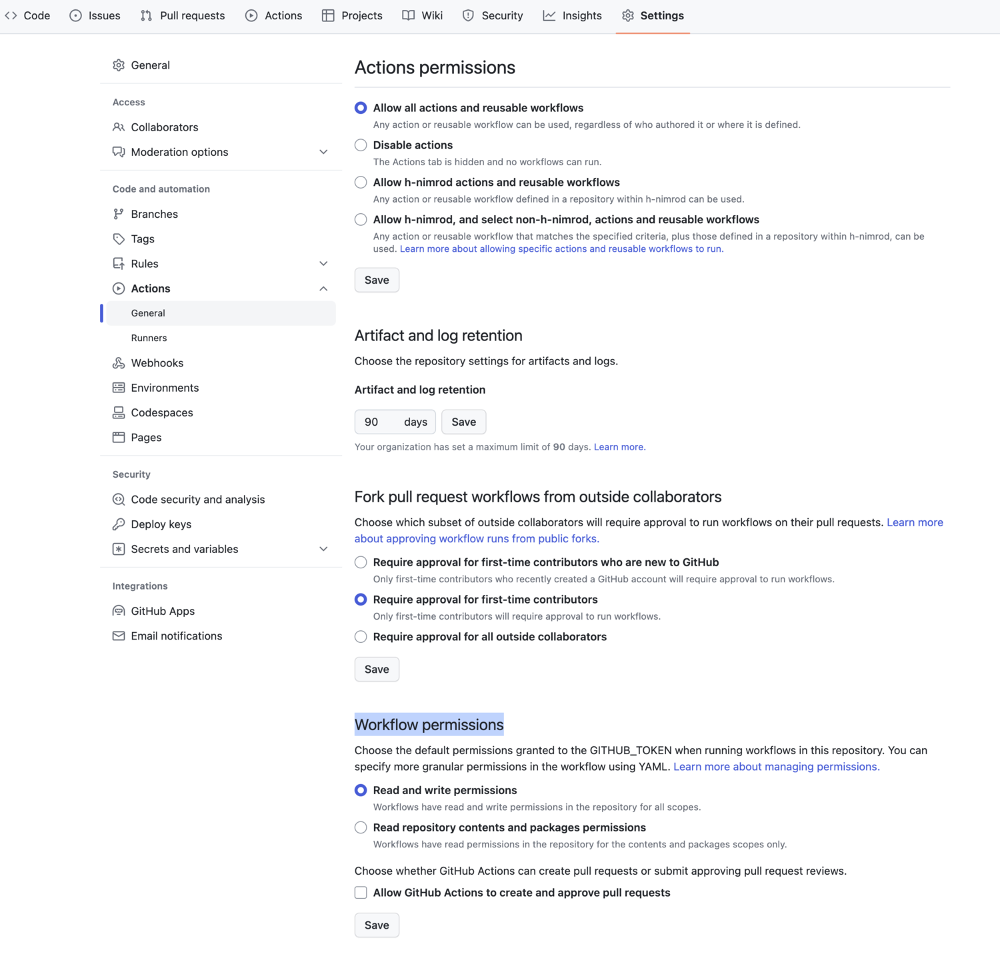

# simple_tag.yaml

## 概要
このGitHub Actionsは、releaseブランチからmainブランチへPRがマージされた際に、自動的にリリースとタグを作成するものです。
タグの値はreleaseブランチ名で指定します。

## トリガー条件
- 以下のすべての条件が揃ったとき
  - PRがマージされたとき
  - 対象のブランチが`main`の場合
  - 元のブランチ名がブランチ名が`release/v`から始まる場合

## 権限
### `github-actions` の権限で実行する場合 (デフォルト)
GitHub Actionsの実行には、"Read and write permissions"が必要です。
GitHubリポジトリのSettingsから適宜設定してください。



```
Settings > Actions > General > Workflow permissions
```

### 個別アカウントの権限で実行する場合

1. 個人アクセストークンの作成:
    - GitHubの「Developer settings」から、Personal access tokensを作成
2. トークンをリポジトリのシークレットとして追加:
    - リポジトリの「Secrets」から「New repository secret」を選択し、上で作成したトークンを設定
    - 設定したトークンの名前を `MY_GITHUB_ACTIONS_TOKEN` としておきます
3. YAMLファイルの更新:
    - `secrets.GITHUB_TOKEN` を `secrets.MY_GITHUB_ACTIONS_TOKEN` に変更

## 具体例
ブランチ名が `release/v0.1.2` から `main` に向けたPRがマージされると、このGitHub Actionsが実行され、タグ`v0.1.2`とリリースノートが作成されます。

